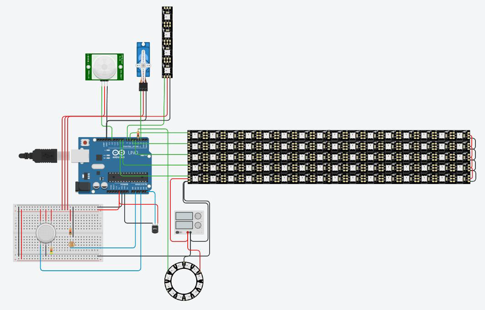
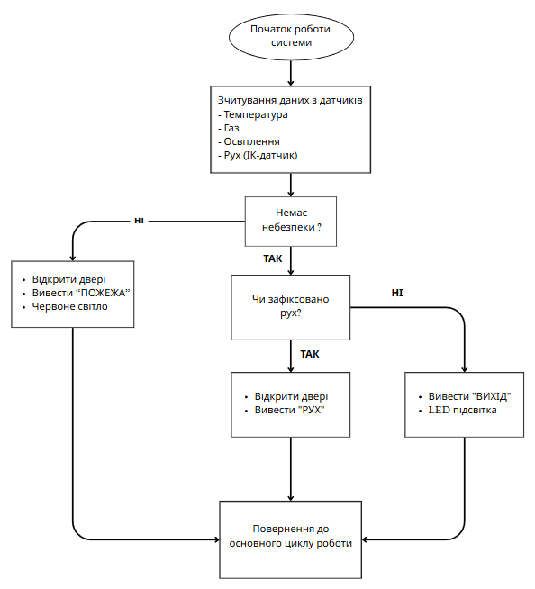
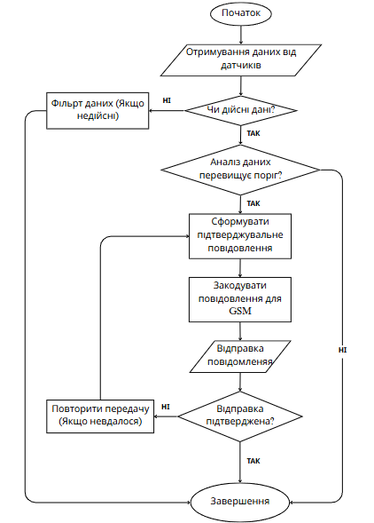
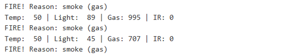

<p align="center">
  
</p>

<h1 align="center">Warning System with GSM</h1>

<p align="center">
  Arduino-based emergency warning system for detecting gas leakage, smoke, high temperature, and motion.
</p>

<p align="center">
  The system reacts automatically by activating visual indicators, opening an emergency exit mechanism, displaying diagnostic messages, and supporting GSM-based SMS notifications.
</p>

<p align="center">
  
  
  
  
  
</p>

---

## Table of Contents

* [Overview](#overview)
* [Project Highlights](#project-highlights)
* [Prototype Layout](#prototype-layout)
* [System Workflow](#system-workflow)
* [Testing Example](#testing-example)
* [How It Works](#how-it-works)
* [System Architecture](#system-architecture)
* [Hardware Components](#hardware-components)
* [Pin Configuration](#pin-configuration)
* [Technologies Used](#technologies-used)
* [Source Code](#source-code)
* [Documentation](#documentation)
* [Project Structure](#project-structure)
* [Testing](#testing)
* [GSM/SMS Logic](#gsmsms-logic)
* [Limitations](#limitations)
* [Future Improvements](#future-improvements)
* [Thesis Context](#thesis-context)
* [Portfolio Value](#portfolio-value)
* [License](#license)

---

## Overview

This project is a hardware-software prototype of an emergency warning system based on Arduino and GSM communication logic.

It was originally developed as part of a bachelor's thesis in Computer Engineering and later refactored into a structured, portfolio-ready embedded systems project.

The system is designed for environments where fast local reaction is important, such as:

* residential buildings;
* educational facilities;
* smart home safety prototypes;
* small industrial areas;
* embedded systems demonstrations;
* IoT safety concept projects.

The prototype monitors environmental conditions, detects dangerous events, activates emergency indication, controls a servo-based door mechanism, and prepares or sends SMS alerts through a GSM module.

---

## Project Highlights

| Area                  | Description                                                     |
| --------------------- | --------------------------------------------------------------- |
| Embedded platform     | Arduino UNO-based firmware                                      |
| Programming language  | Arduino C++                                                     |
| Communication concept | GSM/SMS notification using SIM800L logic                        |
| Main detection types  | Gas, smoke, high temperature, motion                            |
| Visual output         | NeoPixel EXIT, FIRE and emergency indication                    |
| Mechanical output     | Servo-controlled emergency door mechanism                       |
| Diagnostics           | Serial Monitor status output                                    |
| Architecture          | State-based firmware with Normal, Motion, Alarm and Fault modes |
| Testing               | Tinkercad simulation and documented test scenarios              |
| Project type          | Bachelor's thesis prototype and GitHub portfolio project        |

---

## Key Features

* Gas and smoke detection
* High temperature detection
* Motion detection near an emergency exit
* Emergency EXIT indication
* FIRE warning indication
* NeoPixel-based visual alerts
* Servo-controlled emergency door mechanism
* Adaptive LED brightness using a photoresistor
* Serial Monitor diagnostics
* GSM/SMS notification logic
* Buzzer alarm support
* State-based firmware architecture
* Alarm hysteresis and stable reset logic
* SMS anti-spam protection
* Fault mode for invalid sensor values
* Tinkercad-based prototype testing
* Detailed technical documentation

---

## Prototype Layout

The image below shows the original Tinkercad prototype wiring layout used during the thesis development and simulation stage.

> Note: this layout represents the original simulated prototype.
> The current firmware version includes additional GSM/SMS and buzzer logic that may not be fully shown in this diagram.



---

## System Workflow

The diagram below shows the main operating logic of the warning system from the original thesis documentation.

> Note: this workflow diagram contains Ukrainian labels because it was created as part of the original bachelor's thesis materials.
> The current repository documentation explains the same logic in English.



The workflow represents the main behavior of the system:

1. The system starts and reads sensor data.
2. Temperature, gas, light and motion values are checked.
3. If a dangerous condition is detected, the system opens the door, displays FIRE indication and activates red warning light.
4. If no danger is detected, the system checks motion.
5. If motion is detected, the door opens and motion indication is displayed.
6. If no motion is detected, EXIT indication and LED backlight are shown.
7. The system returns to the main monitoring loop.

---

## GSM Notification Flow

The diagram below shows the GSM notification and message transmission logic from the thesis materials.

> Note: this diagram also contains Ukrainian labels because it is preserved from the original thesis documentation.



The GSM notification logic includes:

* receiving sensor data;
* validating and filtering values;
* comparing values with thresholds;
* preparing an alert message;
* formatting the message for GSM transmission;
* sending the message through the GSM module;
* checking whether the message was delivered;
* retrying or repeating transmission if needed.

---

## Testing Example

The screenshot below shows Serial Monitor output during gas/smoke alarm testing.



Example alarm output:

```text
FIRE! Reason: smoke (gas)
Temp: 50 | Light: 89 | Gas: 995 | IR: 0
FIRE! Reason: smoke (gas)
Temp: 50 | Light: 45 | Gas: 707 | IR: 0
FIRE! Reason: smoke (gas)
```

This confirms that the system detected a gas-related emergency condition and displayed diagnostic sensor values for further analysis.

---

## How It Works

The system continuously reads data from connected sensors.

In normal conditions, the system monitors the environment and displays EXIT indication.

When motion is detected, the system opens the emergency door and highlights the evacuation path.

When gas, smoke, or high temperature is detected, the system switches to alarm behavior:

1. Opens the emergency door
2. Activates visual warning indication
3. Displays FIRE animation
4. Activates buzzer alarm if enabled
5. Prints diagnostic data to the Serial Monitor
6. Sends or simulates an SMS alert through GSM logic
7. Keeps alarm active until safe conditions remain stable

---

## System Architecture

The firmware is based on a finite-state machine.

| State    | Description                                                                                                           |
| -------- | --------------------------------------------------------------------------------------------------------------------- |
| `Normal` | Default monitoring mode. Sensors are checked, EXIT indication is active and the door remains closed.                  |
| `Motion` | Activated when motion is detected. The emergency door opens and way LEDs are activated.                               |
| `Alarm`  | Activated when gas/smoke or high temperature is detected. Warning indication, buzzer and GSM/SMS logic are activated. |
| `Fault`  | Activated when sensor values are outside expected limits. The system indicates a fault condition.                     |

This architecture makes the firmware easier to understand, test, debug and extend.

---

## Hardware Components

| Component                | Purpose                                  |
| ------------------------ | ---------------------------------------- |
| Arduino UNO              | Main microcontroller                     |
| MQ-2 gas sensor          | Gas and smoke detection                  |
| TMP36 temperature sensor | Temperature measurement                  |
| SIM800L GSM module       | GSM/SMS notification support             |
| Photoresistor            | Ambient light detection                  |
| IR motion sensor         | Motion detection                         |
| Servo motor              | Emergency door control                   |
| NeoPixel LEDs            | Visual warning and evacuation indication |
| Buzzer                   | Sound alarm during emergency mode        |
| Serial Monitor           | System diagnostics and status output     |
| External power supply    | Stable power for high-current components |

---

## Pin Configuration

| Function             | Arduino Pin |
| -------------------- | ----------- |
| Photoresistor        | A1          |
| IR motion sensor     | D12         |
| Servo motor          | D2          |
| Gas sensor           | A3          |
| Temperature sensor   | A5          |
| Buzzer               | A0          |
| GSM RX               | D10         |
| GSM TX               | D11         |
| Main NeoPixel luster | D3          |
| Way NeoPixels        | D7          |
| Text line 1          | D6          |
| Text line 2          | D5          |
| Text line 3          | D4          |
| Text line 4          | D8          |
| Text line 5          | D9          |

---

## Technologies Used

* Arduino C++
* Arduino UNO
* GSM communication
* SIM800L module
* AT commands
* SoftwareSerial
* Servo library
* Adafruit NeoPixel
* Tinkercad
* Serial Monitor debugging
* NeoPixel LED indication
* Embedded state-machine logic

---

## Source Code

The main firmware is located here:

[`src/main.cpp`](src/main.cpp)

The current firmware includes:

* state-based operating logic;
* sensor filtering;
* gas and temperature alarm thresholds;
* hysteresis reset logic;
* GSM readiness checking;
* SMS alert handling;
* SMS anti-spam timing;
* buzzer support;
* animated EXIT and FIRE indication;
* Serial Monitor diagnostics;
* fault mode;
* adaptive LED brightness.

---

## Documentation

Detailed project documentation is available in the `docs` folder:

| Document                                               | Description                                                                         |
| ------------------------------------------------------ | ----------------------------------------------------------------------------------- |
| [User Guide](docs/user-guide.md)                       | Setup instructions, required components, pin configuration and usage guide          |
| [Testing](docs/testing.md)                             | Test scenarios, expected results, visual evidence and validation notes              |
| [Firmware Architecture](docs/firmware-architecture.md) | Internal code structure, system states, sensor processing and GSM logic             |
| [Hardware Documentation](docs/hardware.md)             | Hardware components, wiring notes, power recommendations and limitations            |
| [Thesis Summary](docs/thesis-summary.md)               | Academic background, thesis goal, implemented functionality and GitHub improvements |

Additional schematic documentation:

| Document                                  | Description                                         |
| ----------------------------------------- | --------------------------------------------------- |
| [Schematics README](schematics/README.md) | Notes about the prototype layout and wiring diagram |

---

## Project Structure

```text
Warning-system-with-GSM/
├── src/
│   └── main.cpp
├── docs/
│   ├── user-guide.md
│   ├── testing.md
│   ├── firmware-architecture.md
│   ├── hardware.md
│   └── thesis-summary.md
├── schematics/
│   ├── README.md
│   └── tinkercad-prototype-layout.png
├── images/
│   ├── readme-banner.png
│   ├── Warning-system-with-GSM.png
│   ├── serial-monitor-gas-alarm.png
│   └── system-workflow.png
├── README.md
├── LICENSE
└── .gitignore
```

---

## Testing

The system was tested in the Tinkercad simulation environment.

The main tested scenarios included:

* normal system operation;
* motion detection;
* high temperature detection;
* gas/smoke detection;
* combined gas and temperature condition;
* LED indication behavior;
* servo motor reaction;
* Serial Monitor diagnostics;
* alarm reset logic.

Some real hardware features, such as SIM800L network registration and real SMS sending, require physical hardware testing.

See the full testing documentation:

[Testing Documentation](docs/testing.md)

---

## GSM/SMS Logic

The firmware includes GSM/SMS notification logic for real hardware usage.

The GSM module is checked using AT commands such as:

* `AT`
* `ATE0`
* `AT+CMGF=1`
* `AT+CPIN?`
* `AT+CSQ`
* `AT+CREG?`

Depending on the alarm reason, the firmware can send different SMS alerts.

Example messages:

```text
Увага! Виявлено дим або газ у приміщенні.
```

```text
Увага! Температура перевищила безпечний рівень.
```

```text
Увага! Виявлено дим або газ і високу температуру.
```

> In simulation mode, SMS messages can be printed to the Serial Monitor instead of being sent through real GSM hardware.

---

## Limitations

This project is an educational and portfolio prototype.

Current limitations:

* GSM/SMS communication requires real SIM800L hardware testing;
* Tinkercad does not fully simulate GSM network behavior;
* MQ-2 requires calibration and warm-up time;
* real sensor values may differ from simulated readings;
* high-current components require proper external power;
* some original thesis diagrams contain Ukrainian labels;
* no PCB version is currently provided;
* no enclosure is currently designed;
* the project is not certified for real emergency use.

---

## Future Improvements

Possible improvements include:

* real SIM800L hardware testing;
* Wi-Fi support using ESP8266 or ESP32;
* Bluetooth configuration;
* mobile application integration;
* OLED or LCD display;
* SD card event logging;
* backup battery power;
* PCB design;
* 3D-printed enclosure;
* GPS location reporting;
* multiple SMS recipients;
* improved sensor calibration;
* cloud dashboard or IoT integration.

---

## Thesis Context

This project was created as a bachelor's thesis focused on the development of an Arduino-based emergency warning system with GSM notification support.

The thesis covered:

* analysis of existing emergency notification systems;
* selection of hardware components;
* Arduino C++ firmware development;
* simulation and testing in Tinkercad;
* emergency scenario validation;
* future improvement possibilities.

The current repository contains an improved and refactored version of the original prototype prepared for GitHub and portfolio presentation.

---

## Portfolio Value

This project demonstrates practical skills in:

* embedded systems development;
* Arduino firmware design;
* sensor-based automation;
* state-machine logic;
* hardware-software integration;
* GSM/SMS communication;
* LED indication systems;
* technical documentation;
* prototype testing and validation;
* academic project refactoring for portfolio presentation.

---

## License

This project is licensed under the MIT License.

See the [LICENSE](LICENSE) file for details.
